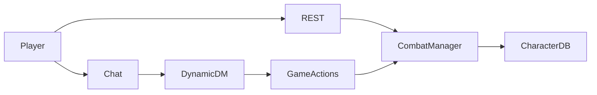
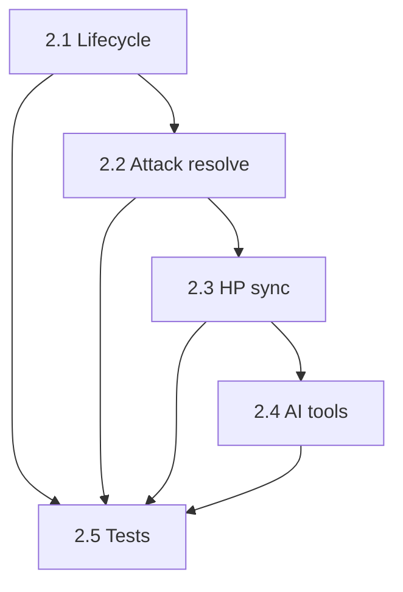

# Phase 2 — Playable Combat (REST / AI, no UI)

**Goal:** A fight can be started, run turn-by-turn, and resolved through REST and Gemini function calls, with character HP staying in sync.

**Locked scope:** Text/REST + AI tools only. No combat tracker UI, no grid, no WebSocket combat events.

**Architecture rule:** `src/combat_system.py` stays source of truth for the active encounter (in-memory). `src/game_actions.py` wraps it for the AI. Character rows stay source of truth for PC HP after sync.



---

## Design decisions (locked)

| Topic | Decision |
| :--- | :--- |
| Persistence | Encounters stay **in-memory** for this phase (survive until process restart / `end_combat`). |
| Frontend | **No** new combat UI. Manual testing via OpenAPI / curl / REST client. |
| Attack math | d20 + attack_bonus vs target AC; on hit roll catalog/weapon damage; miss narrates 0 damage. |
| Monster stats | Copy `attack_bonus` / `damage` from `src/monster_catalog.py` onto combatants at add time. |
| PC sync | Damage/heal on character combatants also updates DB via existing `modify_hp` path. |
| Enemy AI | Minimal: on monster turn, AI (or REST helper) picks a living PC and `resolve_attack`. No pathfinding. |
| Out of scope | Action economy enforcement, death saves in combat, concentration auto-checks, grid, UI, DB-persisted encounters. |

---

## Package 2.1: Encounter lifecycle fix (small)

**Owner files:** `src/combat_system.py`, `src/enhanced_character_api.py`

**Work:**
- Split create vs start: `POST .../combat/start` should create encounter **without** calling `start_combat()` until combatants exist (or add `POST .../combat/{id}/begin` that rolls initiative).
- Add `POST .../combat/{encounter_id}/end` that ends combat and removes from `active_encounters`.
- Document intended order: create → add character(s) → add monster(s) → begin → next-turn loop → end.

**Done when:** REST can create a fight with a PC + goblin, begin (initiative ordered), next-turn advances, end clears it.

---

## Package 2.2: Attack resolution + catalog wiring (medium-small)

**Owner files:** `src/combat_system.py`, `src/monster_catalog.py`, `src/enhanced_character_api.py`, `tests/test_combat.py` (new)

**Work:**
- Extend `Combatant` (or side dict) to hold `attack_bonus` and `damage_dice` for monsters; set in `add_monster_to_combat` from catalog.
- Add `CombatManager.resolve_attack(encounter_id, attacker_id, target_id)` using `src/dice_roller.py`: attack roll vs AC → damage on hit → `take_damage`.
- REST: `POST /api/combat/{encounter_id}/attack` with `attacker_id`, `target_id`.
- For character attackers: store basic melee attack bonus / damage when adding the character (STR/DEX + proficiency or a simple default).

**Done when:** Unit test: goblin attacks PC → hit/miss recorded; damage reduces combatant HP.

---

## Package 2.3: Character HP sync (small)

**Owner files:** `src/combat_system.py` and/or `src/game_actions.py`, damage/heal REST handlers

**Work:**
- When applying damage/heal to a combatant linked to a character id, also update `Character.current_hp` (reuse `GameActions.modify_hp` or shared helper).
- Map combatant id ↔ character id clearly at `add_character_to_combat` time.
- Mirroring combat conditions to `conditions_json` is optional; skip if it bloats the package.

**Done when:** REST attack that damages a PC changes both encounter HP and DB HP (verify via `get_character_status` or character GET).

---

## Package 2.4: AI combat function calling (medium-small)

**Owner files:** `src/game_actions.py`, `src/dynamic_dm.py`

**Work:** Add GameActions + DynamicDM schemas:
- `start_combat_encounter(campaign_id, encounter_name)`
- `add_monster_to_encounter(encounter_id, monster_name)`
- `add_character_to_encounter(encounter_id, character_id)`
- `begin_combat(encounter_id)`
- `get_combat_status(encounter_id)`
- `resolve_attack(encounter_id, attacker_id, target_id)`
- `next_combat_turn(encounter_id)`
- `end_combat(encounter_id)`

Prompt instructions: when combat starts, use these instead of only narrating; include roll results in narration.

**Done when:** Calling GameActions directly (no Gemini required in tests) can run a full mini-fight; schemas present for Gemini.

---

## Package 2.5: Combat smoke tests (small)

**Owner files:** `tests/test_combat.py` (new)

**Work:** Pure engine + GameActions tests (no Gemini):
1. Lifecycle create → add → begin → next → end
2. `resolve_attack` structure / HP change
3. PC HP sync when DB available (skip if no character)

**Done when:** `pytest tests/test_combat.py` passes in `llama_env_311`.

---

## Agent dispatch order



- **Parallel:** 2.1 first; then 2.2; then 2.3; then 2.4; finish 2.5 throughout.
- **Single agent:** run 2.1 → 2.5 in order.
- Prefer one PR / commit series per package (or one PR if one agent).

---

## Manual REST test script (after packages)

```text
1. POST /api/campaigns/{id}/combat/start?encounter_name=ambush
2. POST /api/combat/{eid}/add-character?character_id=...
3. POST /api/combat/{eid}/add-monster?monster_name=goblin
4. POST /api/combat/{eid}/begin
5. GET  /api/combat/{eid}/status
6. POST /api/combat/{eid}/attack  (attacker_id, target_id)
7. POST /api/combat/{eid}/next-turn
8. POST /api/combat/{eid}/end
```

---

## Explicitly deferred

- Combat tracker UI / sidebar
- WebSocket combat push events
- Full action economy, opportunity attacks, death saves in encounter
- Persisting encounters to Postgres
- Expanding monster catalog beyond current seed
